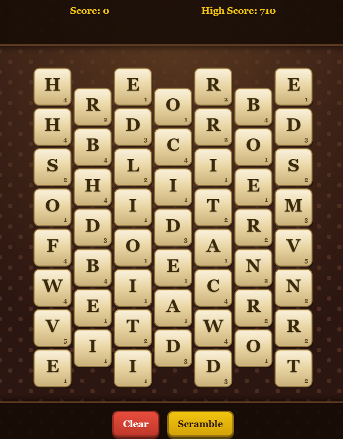

# Word Worm

<p align="center">
  
</p>

A mobile-friendly word-finding puzzle inspired by PopCap's classic [Bookworm](https://en.wikipedia.org/wiki/Bookworm_(video_game)). Connect adjacent letter tiles on a honeycomb grid to spell words — the longer the word, the bigger the gem you earn, and the bigger the next score multiplier. Watch out for burning tiles: they sink one row per turn and end the game if they reach the bottom.

**Play it now:** [https://tcottrill.github.io/wordworm/](https://tcottrill.github.io/wordworm/)

The whole game is a single self-contained `index.html` — no build step, no server, no network calls. The 172,000-word [ENABLE2K](https://en.wikipedia.org/wiki/Words_with_Friends#Dictionary) dictionary is embedded inline as gzipped base64 and decoded in-browser via the native `DecompressionStream` API, so the game works completely offline. It is also a Progressive Web App (PWA), so you can pin it to your iPhone, Android, or desktop and play it like a native app, full-screen and offline.

## Free and open

This project is released into the **public domain** under the [Unlicense](LICENSE). It is **100% free**:

- No purchase, subscription, or in-app payment.
- No ads, no trackers, no analytics.
- No account or sign-in.
- No network calls — once the page is loaded, the game runs entirely on your device.

You may copy, modify, redistribute, or sell it for any purpose.

## How to play

- **Tap or drag** across hex tiles to spell a word. Each tile must touch the previous one. Tap the last selected tile to deselect it, or tap an earlier-selected tile to rewind the chain to that point.
- Words must be **at least 3 letters** and exist in the embedded dictionary. The **Submit** button appears as soon as your current selection is a valid word.
- The score breakdown is shown live below the word: `D+O+S+E = 7  ×2 len  = +140`. Gem multipliers append as `×2 🟢`, `×3 🔴`, etc.

### Gem tiles

Submitting a word triggers a gem on the next refill, based on length:

| Word length | Gem | Multiplier |
| --- | --- | --- |
| 4 | 🟡 Gold | ×1.5 |
| 5 | 🟢 Emerald | ×2 |
| 6 | 🔵 Sapphire | ×2.5 |
| 7 | 🔴 Ruby | ×3 |
| 8+ | 💎 Diamond | ×4 |

Multipliers stack — a 6-letter word that uses a Ruby tile from a previous round scores `base × 4 × 2.5 × 3 × 10` points.

### Burning tiles 🔥

Every 7 words, a fire tile drops at the top of a random column. Each turn it sinks one row. **If a fire tile reaches the bottom row, the game ends.** Use the fire tile in any word to clear it safely. Removing tiles below a fire pulls it down faster via gravity, so be careful which path you pick.

### Scramble

Stuck with a bad board? Tap **Scramble** to re-roll every letter. Gem tiles, fire tiles, and the board layout are preserved — only the letters change. Costs **50 points** (clamped so your score never drops below zero), matching the original Bookworm.

## Install on your iPhone (pin to home screen)

Because it is a PWA, you can add the game to your home screen and launch it like any other app — full-screen, no Safari address bar.

1. On your iPhone, open **Safari** (this only works in Safari — not Chrome or Firefox on iOS) and navigate to [https://tcottrill.github.io/wordworm/](https://tcottrill.github.io/wordworm/).
2. Tap the **Share** button (the square with the up arrow) at the bottom of the screen.
3. Scroll down and tap **Add to Home Screen**.
4. Confirm the name (it will default to "WordWorm") and tap **Add** in the top-right.

A "WordWorm" icon now appears on your home screen. Tap it to launch the game full-screen — it will look and feel like a native app, with no browser chrome.

### Notes (iPhone)

- iOS requires the page be loaded over **HTTPS** for the home-screen app to launch in standalone mode. The GitHub Pages URL above is HTTPS, so it works out of the box.
- The icon and splash background use the `apple-touch-icon.png` and theme color already configured in `index.html` and `site.webmanifest`.
- To remove the app, long-press the icon on the home screen and choose **Remove App → Delete Bookmark**.

## Install on your Android phone (pin to home screen)

Yes — Android supports the same PWA install flow, and on Android it produces an even more app-like result: the game installs through the system's WebAPK mechanism, gets its own entry in the app drawer, and runs in its own window without any browser UI.

### Chrome (recommended)

1. Open **Chrome** on your Android phone and go to [https://tcottrill.github.io/wordworm/](https://tcottrill.github.io/wordworm/).
2. You may see an "Install app" or "Add to Home screen" prompt at the bottom of the screen — tap it and confirm.
3. If no prompt appears, tap the **⋮** (three-dot menu) in the top-right, then choose **Install app** (or **Add to Home screen** on older versions of Chrome).
4. Confirm the name and tap **Install** / **Add**.

A "WordWorm" icon will appear on your home screen and in your app drawer. Tap it to launch the game full-screen.

### Other Android browsers

- **Samsung Internet:** menu → **Add page to** → **Home screen**.
- **Firefox:** menu → **Install** (or **Add to Home screen**), depending on version.
- **Edge:** menu → **Add to phone**.

### Notes (Android)

- To uninstall, long-press the icon and tap **Uninstall** (or drag it to the **Uninstall** target at the top of the screen) — same as any other app.
- Because Android installs it as a WebAPK, the game will also appear under **Settings → Apps**.

## Install on desktop

In Chrome or Edge, the install icon appears in the address bar when the page is loaded over HTTPS. Click it, or open the **⋮** menu and choose **Install Word Worm…**. The game gets its own window with no browser chrome and an entry in your Start menu / Dock.

## Run locally

Open `index.html` directly in any modern browser. That's it.

To test the PWA install flow on desktop, serve the folder over HTTP — for example:

```sh
# Python 3
python -m http.server 8000
```

Then visit `http://localhost:8000` in your browser.

## How the dictionary works

`index.html` contains the entire ENABLE2K wordlist (172,819 words) embedded as a gzipped, base64-encoded `<script id="dict-data" type="application/octet-stream">` block. On load, the game:

1. Reads the base64 text from the inline script tag,
2. Decodes it with `atob` into a `Uint8Array`,
3. Pipes the bytes through the browser's native `DecompressionStream('gzip')`,
4. Splits the result into lines, uppercases each, and adds words ≥3 letters to a `Set`.

This keeps the entire game in one file with no fetches and no network dependency, while still using a real Scrabble-grade dictionary. The decode runs in under 100 ms on a modern phone. `DecompressionStream` is supported in Safari 16.4+, Chrome 80+, Firefox 113+, and every modern Edge.

## Files

- `index.html` — the entire game (HTML, CSS, JavaScript, embedded dictionary).
- `site.webmanifest` — PWA manifest (name, icons, theme color).
- `apple-touch-icon.png`, `apple-touch-icon-152x152.png`, `apple-touch-icon-167x167.png`, `icon-192.png`, `icon-512.png`, `favicon-*.png`, `favicon.ico` — app and tab icons.
- `icon-master.svg` — vector source for the icons.
- `images/wordworm_screen.png` — screenshot used in this README.
- [`PROMPT.md`](PROMPT.md) — a self-contained project brief you can paste into [claude.ai](https://claude.ai) to regenerate this game from scratch. Captures every visual, mechanical, and technical decision in the codebase as a structured spec.
- `LICENSE` — public domain dedication.

## Credits

- Letter frequency distribution derived from PopCap's Bookworm Adventures, via [franklindyer/BWA](https://github.com/franklindyer/BWA).
- Dictionary: [ENABLE2K](https://en.wikipedia.org/wiki/Words_with_Friends#Dictionary), public domain.

## License

[Unlicense](LICENSE) — public domain.
